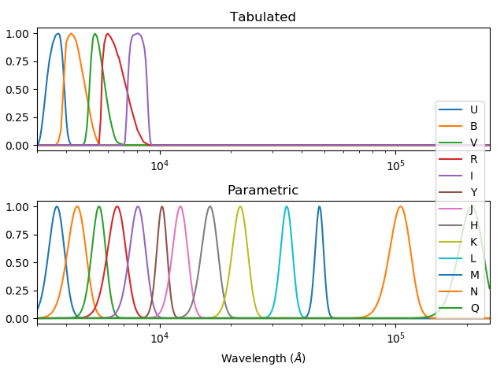

Photometry & Colors API
=======================

Introduction
------------

This section illustrates the API that was developed to solve photometry-related and
color-conversion-related problems to compose the applications ``cubeed.py`` and ``splisted.py``.
Some usage examples of this API in further contexts are shown below.

Examples
--------

Plot bandpass filter shapes
~~~~~~~~~~~~~~~~~~~~~~~~~~~

.. literalinclude:: ../examples/photometry/photometry0.py

.. _figphotometry0:

   -- Bandpass filter shapes in both tabulated and parametric formats.

Passing spectrum throught bandpass filter
~~~~~~~~~~~~~~~~~~~~~~~~~~~~~~~~~~~~~~~~~

.. literalinclude:: ../examples/photometry/photometry1.py

.. _figphotometry1:

   -- Original spectrum, bandpass filter, and filtered spectrum.

Magnitude of spectrum for several bands and systems
~~~~~~~~~~~~~~~~~~~~~~~~~~~~~~~~~~~~~~~~~~~~~~~~~~~

The following example compares flux-to-magnitude conversion of the Vega spectrum
for different magnitude systems.

.. code:: python

    import f311.physics as ph
    import tabulate
    systems = ["stdflux", "ab", "vega"]
    bands = "UBVRIJHK"
    sp = ph.get_vega_spectrum()
    rows = [([band]+[ph.calc_mag(sp, band, system) for system in systems]) for band in bands]
    print(tabulate.tabulate(rows, ["band"]+systems))

This code results in the following table:

::

    band        stdflux          ab    vega
    ------  -----------  ----------  ------
    U        0.00572505   0.761594       -0
    B        0.0696287   -0.10383        -0
    V        0.0218067    0.0191189      -0
    R        0.0359559    0.214645       -0
    I        0.0661095    0.449825       -0
    J       -0.0150993    0.874666       -0
    H        0.0315447    1.34805        -0
    K        0.0246046    1.85948        -0

Convert spectra to RGB colors
~~~~~~~~~~~~~~~~~~~~~~~~~~~~~

The following code plots blackbody spectra using color calculated from their respective spectra.
This procedure can be applied to any spectrum.

.. literalinclude:: ../examples/blackbody-colors.py

.. _figblack:

.. figure:: figures/blackbody-colors.png
   :align: center

   -- Blackbody spectra painted with colors calculated from the spectra themselves.
