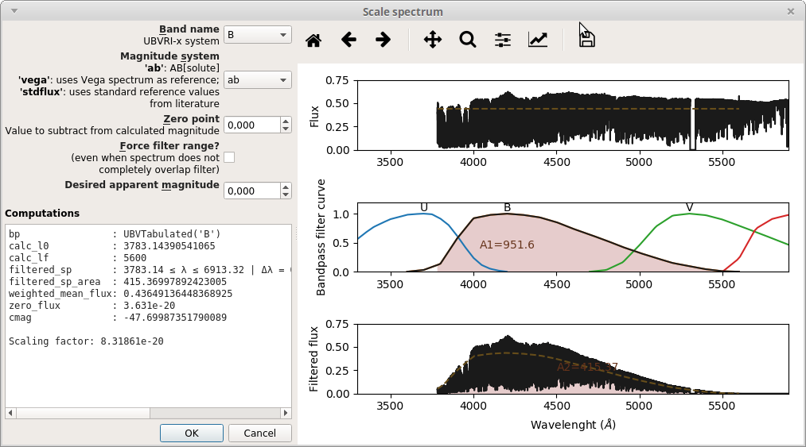

Scale to Magnitude
==================

Both ``splisted.py`` and ``cubeed.py`` have a "Scale to Magnitude" button that can be used to
scale spectra to a desired magnitude in a given magnitude system (standard/AB/Vega) (:numref:`scaletomag0`).

.. _scaletomag0:

   -- "Scale to Magnitude" window