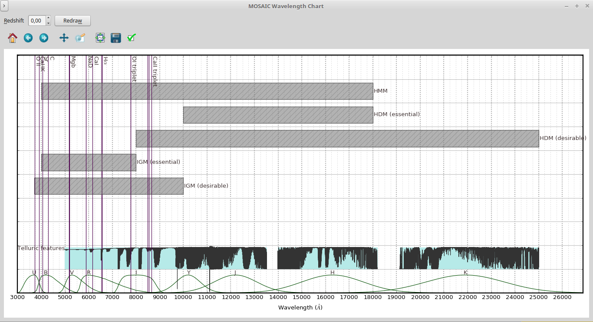

Spectrometre Modes & Spectral Lines of Interest at Redshift
===========================================================

.. code:: shell

    wavelength-chart.py

|image1|

**Figure** -- Lines with zero redshift

This application creates a chart stacking the MOSAIC spectrograph wavelength coverages and
an ESO Earth atmospheric model. This may serve either as a reference to MOSAIC wavelength invervals for each
mode (on this, see also ``list-mosaic-modes.py``) or to verify the Earth atmospheric emission/trasmission
in a wavelength region of observational interest.

It is also possible to inform a redshift so that the chemical lines will be accordingly displaced:

|image2|

**Figure** -- ``z=3.5``

.. |image2| image:: figures/chart-z-35.png

